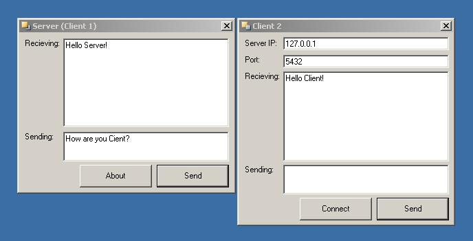



## A Two Way Instant Messenger Application \(Client and Server using the Winsock Control\)

### Description

This is a Two Way Instant Messenger that I made after taking a class on using the Winsock control. It is based on two different programs. One of the two is a server and the other is a client. The Server creates a connection on your computer and the client connects to that and can sent and recieve messeges from the server. When running the two programs, you must run the server first so the client has something to connect to, then you can do whatever you want when the client makes the connection. You can also use this to chat with friends if you know your IP address, you can give them the compiled client and they can type your IP address in and you can chat on two different computers. All the coding in my applications is my work that I learned from the classes I attend. Please Vote and leave comments!
 
### More Info
 

             |
---                |---
**Submitted On**   |2004-06-23 16:18:58
**By**             |[Red Revolver 5](https://github.com/Planet-Source-Code/PSCIndex/blob/master/ByAuthor/red-revolver-5.md)
**Level**          |Intermediate
**User Rating**    |4.6 (23 globes from 5 users)
**Compatibility**  |VB 5\.0, VB 6\.0
**Category**       |[Internet/ HTML](https://github.com/Planet-Source-Code/PSCIndex/blob/master/ByCategory/internet-html__1-34.md)
**World**          |[Visual Basic](https://github.com/Planet-Source-Code/PSCIndex/blob/master/ByWorld/visual-basic.md)
**Archive File**   |[A\_Two\_Way\_1761226232004\.zip](https://github.com/Planet-Source-Code/red-revolver-5-a-two-way-instant-messenger-application-client-and-server-using-the-winsock__1-54560/archive/master.zip)

